# ERD Diagram

```mermaid
erDiagram
    INGEST_BATCHES ||--o{ STG_SALES_DOCUMENTS : loads
    INGEST_BATCHES ||--o{ STG_PURCHASE_DOCUMENTS : loads
    INGEST_BATCHES ||--o{ STG_INVENTORY_DOCUMENTS : loads
    INGEST_BATCHES ||--o{ STG_CASH_TRANSACTIONS : loads
    INGEST_BATCHES ||--o{ STG_SUPPLIER_BALANCES : loads
    INGEST_BATCHES ||--o{ STG_CUSTOMER_BALANCES : loads
    SYNC_STATE ||--o{ INGEST_BATCHES : tracks
    INGEST_BATCHES ||--o{ DEAD_LETTER_QUEUE : failures

    DIM_CALENDAR ||--o{ FACT_SALES_DOCUMENTS : doc_date
    DIM_CALENDAR ||--o{ FACT_PURCHASE_DOCUMENTS : doc_date
    DIM_CALENDAR ||--o{ FACT_INVENTORY_DOCUMENTS : doc_date
    DIM_CALENDAR ||--o{ FACT_CASH_TRANSACTIONS : transaction_date
    DIM_CALENDAR ||--o{ FACT_SUPPLIER_BALANCES : balance_date
    DIM_CALENDAR ||--o{ FACT_CUSTOMER_BALANCES : balance_date

    DIM_BRANCHES ||--o{ FACT_SALES_DOCUMENTS : branch_id
    DIM_BRANCHES ||--o{ FACT_PURCHASE_DOCUMENTS : branch_id
    DIM_BRANCHES ||--o{ FACT_INVENTORY_DOCUMENTS : branch_id
    DIM_BRANCHES ||--o{ FACT_CASH_TRANSACTIONS : branch_id
    DIM_BRANCHES ||--o{ FACT_SUPPLIER_BALANCES : branch_id
    DIM_BRANCHES ||--o{ FACT_CUSTOMER_BALANCES : branch_id

    DIM_PRODUCTS ||--o{ FACT_SALES_DOCUMENTS : product_or_item
    DIM_PRODUCTS ||--o{ FACT_PURCHASE_DOCUMENTS : product_or_item
    DIM_PRODUCTS ||--o{ FACT_INVENTORY_DOCUMENTS : product_or_item
    DIM_CATEGORIES ||--o{ DIM_PRODUCTS : category_id
    DIM_BRANDS ||--o{ DIM_PRODUCTS : brand_id
    DIM_WAREHOUSES ||--o{ FACT_SALES_DOCUMENTS : warehouse_id
    DIM_WAREHOUSES ||--o{ FACT_PURCHASE_DOCUMENTS : warehouse_id
    DIM_WAREHOUSES ||--o{ FACT_INVENTORY_DOCUMENTS : warehouse_id
    DIM_DOCUMENT_TYPES ||--o{ FACT_SALES_DOCUMENTS : document_type
    DIM_DOCUMENT_TYPES ||--o{ FACT_PURCHASE_DOCUMENTS : document_type
    DIM_PAYMENT_METHODS ||--o{ FACT_SALES_DOCUMENTS : payment_method
    DIM_PAYMENT_METHODS ||--o{ FACT_PURCHASE_DOCUMENTS : payment_method

    DIM_SUPPLIERS ||--o{ FACT_PURCHASE_DOCUMENTS : supplier_id
    DIM_SUPPLIERS ||--o{ FACT_SUPPLIER_BALANCES : supplier_id
    DIM_CUSTOMERS ||--o{ FACT_SALES_DOCUMENTS : customer_id
    DIM_CUSTOMERS ||--o{ FACT_CUSTOMER_BALANCES : customer_id
    DIM_ACCOUNTS ||--o{ FACT_CASH_TRANSACTIONS : account_id

    FACT_SALES_DOCUMENTS ||--o{ AGG_SALES_DAILY : aggregate
    FACT_SALES_DOCUMENTS ||--o{ AGG_SALES_MONTHLY : aggregate
    FACT_PURCHASE_DOCUMENTS ||--o{ AGG_PURCHASES_DAILY : aggregate
    FACT_PURCHASE_DOCUMENTS ||--o{ AGG_PURCHASES_MONTHLY : aggregate
    FACT_INVENTORY_DOCUMENTS ||--o{ AGG_INVENTORY_SNAPSHOT : aggregate
    FACT_INVENTORY_DOCUMENTS ||--o{ AGG_STOCK_AGING : aggregate
    FACT_CASH_TRANSACTIONS ||--o{ AGG_CASH_DAILY : aggregate
    FACT_CASH_TRANSACTIONS ||--o{ AGG_CASH_BY_TYPE : aggregate
    FACT_CASH_TRANSACTIONS ||--o{ AGG_CASH_ACCOUNTS : aggregate
    FACT_SUPPLIER_BALANCES ||--o{ AGG_SUPPLIER_BALANCES_DAILY : aggregate
    FACT_CUSTOMER_BALANCES ||--o{ AGG_CUSTOMER_BALANCES_DAILY : aggregate

    INSIGHT_RULES ||--o{ INSIGHT_RUNS : executes
    INSIGHT_RUNS ||--o{ INSIGHTS : generates
```

Notes:
- `dim_products` is implemented as a canonical compatibility view over `dim_items`.
- `fact_sales_documents` / `fact_purchase_documents` / `fact_inventory_documents` / `fact_cash_transactions` are canonical compatibility views.
- Dashboard contracts must read only `agg_*` tables.
