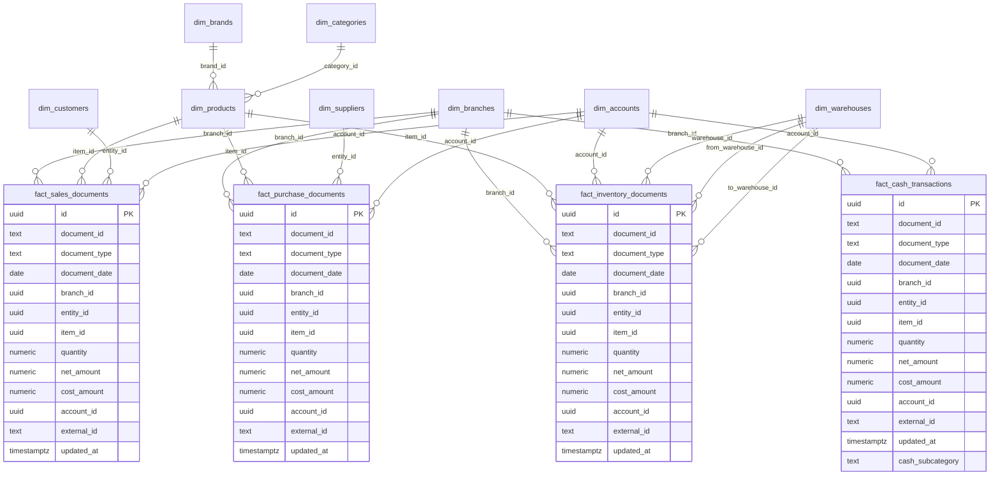

# Revised Data Model (4 Stream Canonical Architecture)

Date: 2026-03-06

## 1) Target principle

All BI outputs must be derived from exactly four source-of-truth document streams:
- `fact_sales_documents`
- `fact_purchase_documents`
- `fact_inventory_documents`
- `fact_cash_transactions`

No KPI or intelligence rule should directly depend on non-stream ad-hoc structures.

## 2) Canonical grain

- Sales stream grain: one row per sales document line.
- Purchase stream grain: one row per purchase document line.
- Inventory stream grain: one row per inventory movement document line.
- Cash stream grain: one row per cash transaction entry.

## 3) Required canonical fields in every fact

Every fact includes the required cross-stream columns:
- `document_id`
- `document_type`
- `document_date`
- `branch_id`
- `entity_id` (customer/supplier/other counterparty)
- `item_id` (nullable when not applicable)
- `quantity`
- `net_amount`
- `cost_amount`
- `account_id` (nullable except cash stream)
- `external_id`
- `updated_at`

## 4) Stream-specific taxonomy

Sales document types:
- `invoice`
- `receipt`
- `credit_note`
- `pos_sale`

Purchase document types:
- `supplier_invoice`
- `purchase_receipt`
- `purchase_credit_note`

Inventory document types:
- `stock_transfer`
- `stock_adjustment`
- `stock_entry`
- `stock_exit`
- `inventory_correction`

Cash subcategories (mandatory):
- `customer_collections`
- `customer_transfers`
- `supplier_payments`
- `supplier_transfers`
- `financial_accounts`

## 5) Dimension model

Mandatory dimensions:
- `dim_branches`
- `dim_products`
- `dim_suppliers`
- `dim_customers`
- `dim_categories`
- `dim_brands`
- `dim_accounts`

Operationally required supporting dimensions:
- `dim_warehouses` (required for warehouse documents)
- `dim_document_status` (posted/canceled/reversed)
- `dim_payment_methods` (cash, card, transfer, mixed)

## 6) Stream-to-dimension relationship rules

- Sales facts: `entity_id` references customer domain when entity type is customer.
- Purchase facts: `entity_id` references supplier domain when entity type is supplier.
- Inventory facts: item + warehouse context is mandatory for transfer/entry/exit types.
- Cash facts: `account_id` is mandatory and `cash_subcategory` must always be one of the five categories.

## 7) Derived analytical layer

Derived marts (downstream only):
- `agg_sales_daily`, `agg_sales_monthly`, `agg_sales_item_daily`
- `agg_purchases_daily`, `agg_purchases_monthly`
- `agg_inventory_movement_daily`, `agg_inventory_balance_daily`
- `agg_cash_daily`, `agg_cash_reconciliation_daily`

Rule: all derived marts are pure transformations from the four stream facts.

## 8) Revised ER diagram

## 9) Migration strategy (high level)

Phase 1:
- Introduce new stream facts and dimensions in parallel.
- Dual-write ingestion into old and new facts.

Phase 2:
- Rebuild KPI/intelligence derived marts from new stream facts.
- Validate KPI parity and reconciliation controls.

Phase 3:
- Switch APIs and rules to new marts.
- Decommission legacy fact contract and ext-id-only dependencies.
