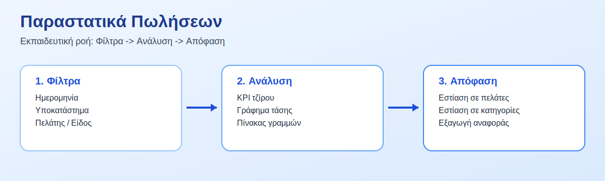
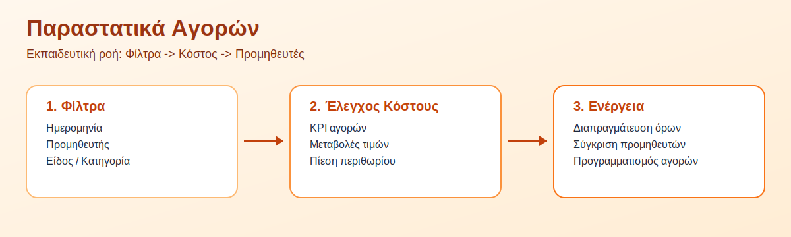
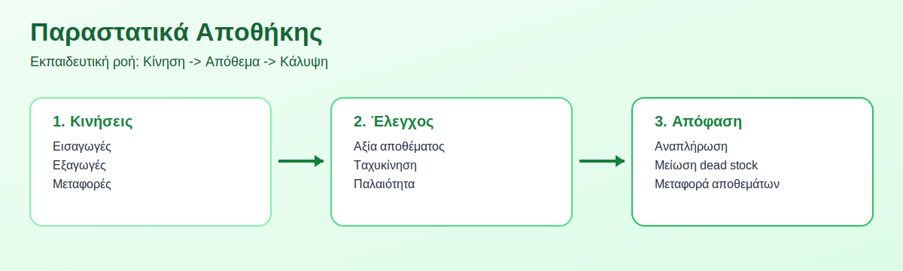
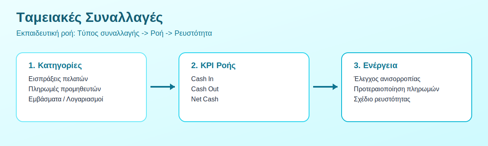
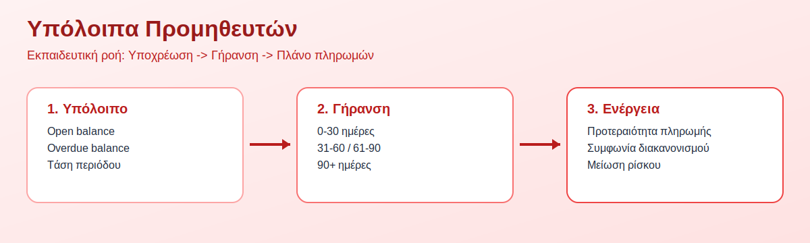
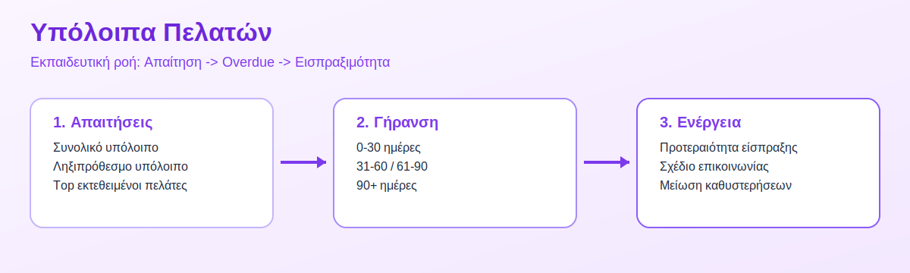
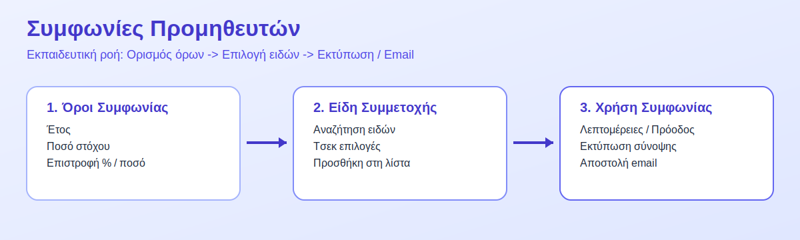

# BoxVisio BI - User Manual (Training Edition)

## 1. Πώς να χρησιμοποιήσεις αυτό το manual
Αυτό το εγχειρίδιο είναι σε μορφή εκπαίδευσης.

Σε κάθε μάθημα θα βρεις:
- στόχο μαθήματος
- απλά βήματα
- μικρή άσκηση ελέγχου

Προτεινόμενος τρόπος:
1. Άνοιξε την αντίστοιχη σελίδα στο tenant portal.
2. Ακολούθησε τα βήματα με τη σειρά.
3. Κάνε την άσκηση και επιβεβαίωσε ότι κατάλαβες τη λειτουργία.

## 2. Κουμπί Βοήθειας μέσα από κάθε κύκλωμα
- Σε κάθε κύκλωμα υπάρχει κουμπί `Βοήθεια`.
- Το κουμπί ανοίγει το `/tenant/manual` στη σωστή ενότητα.
- Παράδειγμα:
  - Παραστατικά Πωλήσεων -> `/tenant/manual#sales-documents`
  - Παραστατικά Αγορών -> `/tenant/manual#purchase-documents`

## 3. Μαθήματα Επιχειρησιακών Κυκλωμάτων

### 3.1 Μάθημα: Παραστατικά Πωλήσεων
- URL: `/tenant/sales-documents`
- Εικόνα εκπαίδευσης:
  - 
- Στόχος:
  - Να εντοπίζεις γρήγορα ποιοι πελάτες/είδη οδηγούν τον τζίρο.
- Βήματα:
  1. Όρισε περίοδο.
  2. Επίλεξε υποκατάστημα.
  3. Χρησιμοποίησε αναζήτηση πελάτη ή είδους.
  4. Δες KPI + πίνακα.
  5. Κατέγραψε συμπέρασμα.
- Άσκηση:
  - Βρες τις 5 υψηλότερες πωλήσεις της εβδομάδας.

### 3.2 Μάθημα: Παραστατικά Αγορών
- URL: `/tenant/purchase-documents`
- Εικόνα εκπαίδευσης:
  - 
- Στόχος:
  - Να ελέγχεις το κόστος και να προετοιμάζεις διαπραγμάτευση.
- Βήματα:
  1. Φίλτρο σε προμηθευτή + ημερομηνία.
  2. Έλεγχος μεταβολών κόστους.
  3. Σύγκριση προμηθευτών.
  4. Επισήμανση κρίσιμων ειδών.
- Άσκηση:
  - Εντόπισε 3 είδη με μεγαλύτερη αύξηση κόστους.

### 3.3 Μάθημα: Παραστατικά Αποθήκης
- URL: `/tenant/warehouse-documents`
- Εικόνα εκπαίδευσης:
  - 
- Στόχος:
  - Να ελέγχεις κινήσεις και να προλαβαίνεις ελλείψεις.
- Βήματα:
  1. Φίλτρο σε αποθήκη και τύπο κίνησης.
  2. Επιλογή είδους.
  3. Έλεγχος εισαγωγών/εξαγωγών.
  4. Απόφαση για αναπλήρωση.

### 3.4 Μάθημα: Ταμειακές Συναλλαγές
- URL: `/tenant/cashflow`
- Εικόνα εκπαίδευσης:
  - 
- Στόχος:
  - Να έχεις καθαρή εικόνα ρευστότητας (cash in/cash out/net cash).
- Βήματα:
  1. Επίλεξε κατηγορία συναλλαγής.
  2. Βάλε φίλτρα ημερομηνίας και λογαριασμού.
  3. Σύγκρινε εισροές/εκροές.
  4. Έλεγξε καθαρή ροή.
  5. Προγραμμάτισε ενέργειες.

### 3.5 Μάθημα: Υπόλοιπα Προμηθευτών
- URL: `/tenant/suppliers`
- Εικόνα εκπαίδευσης:
  - 
- Στόχος:
  - Να μειώνεις overdue υποχρεώσεις με προτεραιοποίηση πληρωμών.
- Βήματα:
  1. Αναζήτησε προμηθευτή.
  2. Δες open/overdue υπόλοιπο.
  3. Δες aging buckets.
  4. Οργάνωσε σειρά πληρωμών.

### 3.6 Μάθημα: Υπόλοιπα Πελατών
- URL: `/tenant/customers`
- Εικόνα εκπαίδευσης:
  - 
- Στόχος:
  - Να βελτιώνεις εισπραξιμότητα και να περιορίζεις καθυστερήσεις.
- Βήματα:
  1. Φίλτρο σε πελάτη/περίοδο.
  2. Έλεγχος ληξιπρόθεσμων.
  3. Ανάλυση aging.
  4. Σχέδιο follow-up.

## 4. Μάθημα: Συμφωνίες Προμηθευτών
- URL: `/tenant/supplier-targets`
- Εικόνα εκπαίδευσης:
  - 
- Στόχος:
  - Να ορίζεις και να διαχειρίζεσαι συμφωνίες με σαφή και επαναλήψιμο τρόπο.
- Βήματα:
  1. Συμπλήρωσε στόχο, ποσοστό και σταθερό ποσό επιστροφής.
  2. Επίλεξε συμμετέχοντα είδη.
  3. Αποθήκευσε συμφωνία.
  4. Άνοιξε λεπτομέρειες για έλεγχο.
  5. Χρησιμοποίησε `Εκτύπωση` ή `Αποστολή email`.
- Κανόνας κύκλου ζωής:
  - Ληγμένες συμφωνίες γίνονται ανενεργές και δεν επεξεργάζονται.
  - Για νέα περίοδο χρησιμοποίησε `Αντιγραφή`.

## 5. Μαθήματα Αναλύσεων
- Αναλύσεις Πωλήσεων: `/tenant/sales`
- Αναλύσεις Αγορών: `/tenant/purchases`
- Αναλύσεις Αποθέματος: `/tenant/inventory`
- Είδη Αποθήκης: `/tenant/items`

Χρήση:
1. Ξεκίνα από KPI κάρτες.
2. Πήγαινε στα γραφήματα για τάση.
3. Κατέληξε στον πίνακα για λεπτομέρεια.

## 6. Συχνά λάθη και γρήγορες λύσεις
- Δεν βλέπω δεδομένα:
  - Έλεγξε ημερομηνία, υποκατάστημα, φίλτρα επιλογών.
- Δεν βρίσκω συμφωνία:
  - Έλεγξε έτος στόχου και αναζήτηση ονόματος.
- Δεν επιτρέπει επεξεργασία συμφωνίας:
  - Πιθανότατα είναι ανενεργή (λήξη περιόδου). Χρησιμοποίησε `Αντιγραφή`.

## 7. Συντόμευση εκπαίδευσης για νέα μέλη ομάδας (30 λεπτά)
1. 10 λεπτά: Παραστατικά Πωλήσεων + Αγορών.
2. 10 λεπτά: Υπόλοιπα Προμηθευτών + Πελατών.
3. 10 λεπτά: Συμφωνίες Προμηθευτών + Εκτύπωση/Email.
