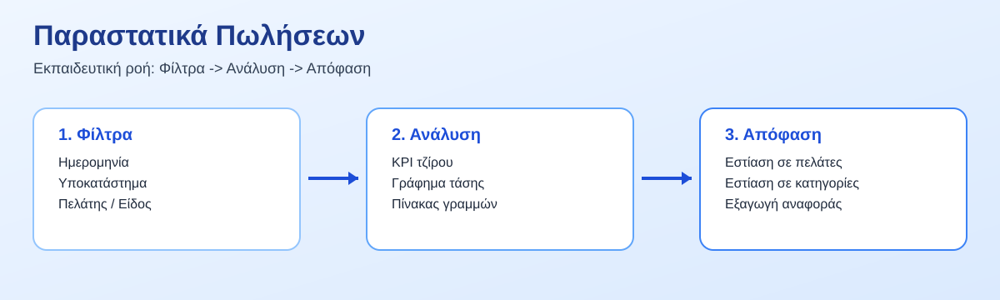
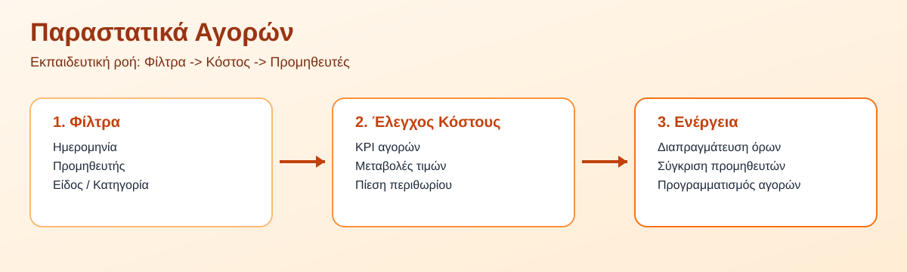
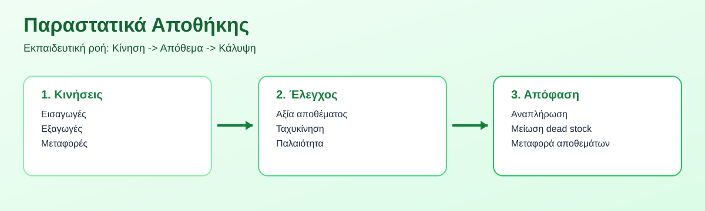
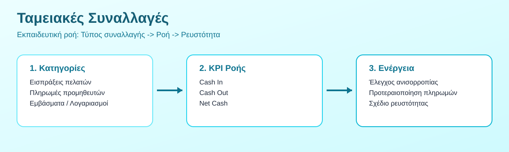
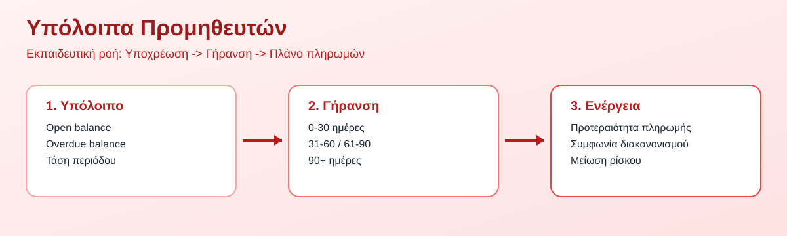
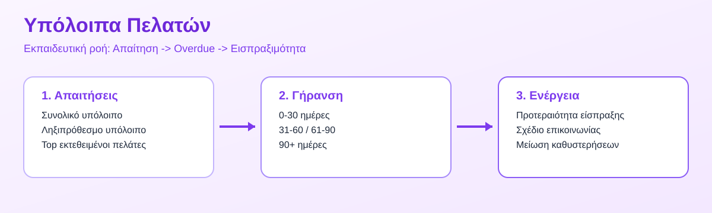
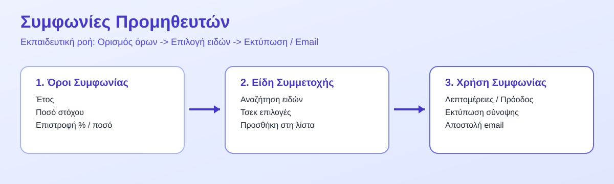

# BoxVisio BI - Production User Manual

Έκδοση εγχειριδίου: `v2026.05.21-rc1`

Το BoxVisio BI συγκεντρώνει δεδομένα από SoftOne και τα μετατρέπει σε επιχειρησιακή εικόνα για πωλήσεις, αγορές, αποθήκη, ταμειακές ροές, υπόλοιπα, e-shop, έλεγχο τιμών, replenishment και διοικητικές προτάσεις.

Το manual είναι γραμμένο για τελικό χρήστη που δεν γνωρίζει τεχνικές λεπτομέρειες. Στόχος του είναι να εξηγεί τι δείχνει κάθε κύκλωμα, πώς διαβάζονται οι βασικοί δείκτες και τι πρέπει να ελέγχει ο χρήστης πριν βγάλει συμπέρασμα.

## 1. Πώς να χρησιμοποιήσεις αυτό το manual
Αυτό το εγχειρίδιο είναι οδηγός παραγωγικής χρήσης.

Σε κάθε κύκλωμα θα βρεις:
- τι απαντά το κύκλωμα
- ποια KPI πρέπει να διαβάζεις
- τι υπολογίζεται
- ποια popups/αναλύσεις υπάρχουν
- τι να ελέγχεις όταν κάτι δεν συμφωνεί

Προτεινόμενος τρόπος:
1. Άνοιξε την αντίστοιχη σελίδα στο tenant portal.
2. Ακολούθησε τα βήματα με τη σειρά.
3. Κάνε την άσκηση και επιβεβαίωσε ότι κατάλαβες τη λειτουργία.

## 2. Κουμπί Βοήθειας μέσα από κάθε κύκλωμα
- Σε κάθε κύκλωμα υπάρχει κουμπί `Βοήθεια`.
- Το κουμπί ανοίγει το `/tenant/manual` στη σωστή ενότητα.
- Παράδειγμα:
  - Παραστατικά Πωλήσεων -> `/tenant/manual#sales-documents`
  - Παραστατικά Αγορών -> `/tenant/manual#purchase-documents`
  - Παραγγελίες Προμηθευτών -> `/tenant/manual#supplier-orders`

## 3. Τι σημαίνει το `SoftOne Sync` επάνω δεξιά
- Στο πάνω δεξιά μέρος της οθόνης εμφανίζεται η ένδειξη `SoftOne Sync`.
- Δείχνει την τελευταία ημερομηνία και ώρα που το BI πήρε δεδομένα από το SoftOne του tenant.
- Αν βλέπεις παλιά ώρα:
  - έλεγξε αν έχει ολοκληρωθεί ο συγχρονισμός
  - έλεγξε αν τα KPIs που βλέπεις αντιστοιχούν στην περίοδο που περίμενες
- Αν δείχνει `Δεν υπάρχει ακόμη`, σημαίνει ότι δεν έχει καταγραφεί ακόμη επιτυχής συγχρονισμός για τον tenant.

## 3A. Τι σημαίνει η `Ώρα Καταχώρισης`
- Σε κάποια γραφήματα ώρας, το σύστημα δείχνει την ώρα που το παραστατικό καταχωρίστηκε στο SoftOne.
- Δεν δείχνει την ώρα που το παραστατικό πέρασε στο BI.
- Αυτό είναι σημαντικό γιατί έτσι βλέπεις την πραγματική ροή εργασίας του καταστήματος μέσα στη μέρα.
- Αν λείπει η ώρα από το ERP για κάποια ημέρα:
  - το BI μπορεί να δείξει συνολικό ποσό χωρίς πλήρη ωριακή κατανομή
  - αυτό δεν σημαίνει απαραίτητα λάθος στον τζίρο
  - σημαίνει ότι δεν υπήρχε διαθέσιμη ακριβής ώρα καταχώρισης

## 4. Μαθήματα Επιχειρησιακών Κυκλωμάτων

### 3.1 Μάθημα: Παραστατικά Πωλήσεων
- URL: `/tenant/sales-documents`
- Εικόνα εκπαίδευσης:
  - 
- Στόχος:
  - Να εντοπίζεις γρήγορα ποιοι πελάτες/είδη οδηγούν τον τζίρο.
- Βήματα:
  1. Όρισε περίοδο.
  2. Επίλεξε υποκατάστημα.
  3. Χρησιμοποίησε αναζήτηση πελάτη ή είδους.
  4. Δες KPI + πίνακα.
  5. Κατέγραψε συμπέρασμα.
- Άσκηση:
  - Βρες τις 5 υψηλότερες πωλήσεις της εβδομάδας.

### 3.2 Μάθημα: Παραστατικά Αγορών
- URL: `/tenant/purchase-documents`
- Εικόνα εκπαίδευσης:
  - 
- Στόχος:
  - Να ελέγχεις το κόστος και να προετοιμάζεις διαπραγμάτευση.
- Βήματα:
  1. Φίλτρο σε προμηθευτή + ημερομηνία.
  2. Έλεγχος μεταβολών κόστους.
  3. Σύγκριση προμηθευτών.
  4. Επισήμανση κρίσιμων ειδών.
- Άσκηση:
  - Εντόπισε 3 είδη με μεγαλύτερη αύξηση κόστους.

### 3.2A Μάθημα: Παραγγελίες Προμηθευτών
- URL: `/tenant/supplier-orders`
- Στόχος:
  - Να βλέπεις ποιες παραγγελίες προς προμηθευτές είναι ακόμη ανοιχτές πριν δημιουργηθεί νέα πρόταση FnR.
- Βασικός κανόνας:
  - Ανοιχτή είναι παραγγελία που δεν έχει μετασχηματιστεί σε παραστατικό αγοράς.
  - Αν έχει γίνει μετασχηματισμός, θεωρείται κλειστή, ακόμη και αν η παράδοση ήταν μερική.
  - Το BI δεν κρατά backorders.
- Βήματα:
  1. Όρισε περίοδο ή χρησιμοποίησε το default lookback του tenant.
  2. Επίλεξε `Μόνο ανοιχτές`.
  3. Έλεγξε προμηθευτές, ανοιχτά τεμάχια και αξία.
  4. Δες γραμμές ειδών για να καταλάβεις τι περιμένεις από κάθε προμηθευτή.
- Άσκηση:
  - Βρες τον προμηθευτή με τη μεγαλύτερη αξία ανοιχτών παραγγελιών.

### 3.3 Μάθημα: Παραστατικά Αποθήκης
- URL: `/tenant/warehouse-documents`
- Εικόνα εκπαίδευσης:
  - 
- Στόχος:
  - Να ελέγχεις κινήσεις και να προλαβαίνεις ελλείψεις.
- Βήματα:
  1. Φίλτρο σε αποθήκη και τύπο κίνησης.
  2. Επιλογή είδους.
  3. Έλεγχος εισαγωγών/εξαγωγών.
  4. Απόφαση για αναπλήρωση.

### 3.4 Μάθημα: Ταμειακές Συναλλαγές
- URL: `/tenant/cashflow`
- Εικόνα εκπαίδευσης:
  - 
- Στόχος:
  - Να έχεις καθαρή εικόνα ρευστότητας (cash in/cash out/net cash).
- Βήματα:
  1. Επίλεξε κατηγορία συναλλαγής.
  2. Βάλε φίλτρα ημερομηνίας και λογαριασμού.
  3. Σύγκρινε εισροές/εκροές.
  4. Έλεγξε καθαρή ροή.
  5. Προγραμμάτισε ενέργειες.

### 3.5 Μάθημα: Υπόλοιπα Προμηθευτών
- URL: `/tenant/suppliers`
- Εικόνα εκπαίδευσης:
  - 
- Στόχος:
  - Να μειώνεις overdue υποχρεώσεις με προτεραιοποίηση πληρωμών.
- Βήματα:
  1. Αναζήτησε προμηθευτή.
  2. Δες open/overdue υπόλοιπο.
  3. Δες aging buckets.
  4. Οργάνωσε σειρά πληρωμών.

### 3.6 Μάθημα: Υπόλοιπα Πελατών
- URL: `/tenant/customers`
- Εικόνα εκπαίδευσης:
  - 
- Στόχος:
  - Να βελτιώνεις εισπραξιμότητα και να περιορίζεις καθυστερήσεις.
- Βήματα:
  1. Φίλτρο σε πελάτη/περίοδο.
  2. Έλεγχος ληξιπρόθεσμων.
  3. Ανάλυση aging.
  4. Σχέδιο follow-up.

## 5. Μάθημα: Συμφωνίες Προμηθευτών
- URL: `/tenant/supplier-targets`
- Εικόνα εκπαίδευσης:
  - 
- Στόχος:
  - Να ορίζεις και να διαχειρίζεσαι συμφωνίες με σαφή και επαναλήψιμο τρόπο.
- Βήματα:
  1. Συμπλήρωσε στόχο, ποσοστό και σταθερό ποσό επιστροφής.
  2. Επίλεξε συμμετέχοντα είδη.
  3. Αποθήκευσε συμφωνία.
  4. Άνοιξε λεπτομέρειες για έλεγχο.
  5. Χρησιμοποίησε `Εκτύπωση` ή `Αποστολή email`.
- Κανόνας κύκλου ζωής:
  - Ληγμένες συμφωνίες γίνονται ανενεργές και δεν επεξεργάζονται.
  - Για νέα περίοδο χρησιμοποίησε `Αντιγραφή`.

## 6. Μαθήματα Αναλύσεων
- Αναλύσεις Πωλήσεων: `/tenant/sales`
- Αναλύσεις Αγορών: `/tenant/purchases`
- Αναλύσεις Αποθέματος: `/tenant/inventory`
- Είδη Αποθήκης: `/tenant/items`
- Λειτουργικά Έξοδα: `/tenant/operating-expenses`

Χρήση:
1. Ξεκίνα από KPI κάρτες.
2. Πήγαινε στα γραφήματα για τάση.
3. Κατέληξε στον πίνακα για λεπτομέρεια.

### 6.1 Ωριαία Εξέλιξη Τζίρου (Intraday)
- Η ωριαία εξέλιξη δείχνει πώς μοιράζεται ο τζίρος μέσα στην ίδια ημέρα.
- Χρήση:
  1. Επίλεξε συγκεκριμένη ημέρα.
  2. Αν υπάρχει επιλογή καταστήματος, κράτησε ένα ή περισσότερα υποκαταστήματα.
  3. Δες ποιες ώρες έχουν κορύφωση.
  4. Σύγκρινε ώρες αιχμής μεταξύ υποκαταστημάτων.
- Τι σε βοηθά να καταλάβεις:
  - πότε υπάρχει μεγαλύτερη εμπορική κίνηση
  - αν χρειάζεται καλύτερη στελέχωση σε ώρες αιχμής
  - αν η κατανομή πωλήσεων αλλάζει από μέρα σε μέρα
- Σημαντικό:
  - οι ώρες βασίζονται στην ώρα καταχώρισης στο SoftOne
  - όχι στην ώρα συγχρονισμού του BI

## 7. Είδη Αποθήκης: πώς διαβάζω τα status
- Στη σελίδα `/tenant/items` κάθε είδος μπορεί να ανήκει σε status όπως:
  - `Ταχυκίνητο`
  - `Κανονική κινητικότητα`
  - `Αργοκίνητο`
- Το `Ενεργό/Ανενεργό` μπορεί να έρχεται:
  - είτε από το SoftOne
  - είτε από τη λογική του BI με βάση την τελευταία πώληση
- Άρα, αν δεις διαφορά σε status μεταξύ tenants, αυτό μπορεί να είναι συνειδητή ρύθμιση του tenant και όχι λάθος.

## 8. Κανόνες SoftOne: τι πρέπει να ξέρεις σαν χρήστης
- Οι κανόνες παραστατικών στο BI έχουν φτιαχτεί ώστε να ακολουθούν τη λογική του SoftOne.
- Τα ονόματα παραστατικών εμφανίζονται με την ονομασία του SoftOne για να μην υπάρχουν μπερδέματα.
- Τα πιστωτικά παραστατικά δεν σημαίνουν πάντα “έξοδο”.
  - Μπορεί να είναι αντιστροφή εσόδου.
  - Γι’ αυτό οι κανόνες ξεχωρίζουν:
    - αν μετράει σε έσοδα
    - αν μετράει σε ποσότητες
    - αν μετράει σε κόστος
    - ποιο είναι το πρόσημο της αξίας
- Αν κάτι φαίνεται “ανάποδο” σε KPI, πρέπει να ελεγχθεί πρώτα ο κανόνας του παραστατικού.

## 9. Κανόνες KPI ανά σειρά παραστατικού
- Το BI μπορεί να έχει ειδικούς κανόνες συμμετοχής KPI ανά σειρά παραστατικού.
- Αυτό δεν αλλάζει τα αποθηκευμένα παραστατικά.
- Αλλάζει μόνο το αν μια σειρά συμμετέχει ή όχι σε συγκεκριμένο KPI, π.χ. στον τζίρο.
- Η λειτουργία αυτή χρησιμοποιείται όταν θέλουμε:
  - να παραμείνει το νέο BI γενικό και σωστό
  - αλλά να ταιριάξει και με αποδεδειγμένη επιχειρησιακή λογική ενός tenant
- Άρα:
  - τα raw δεδομένα μένουν μέσα
  - οι KPI κανόνες αποφασίζουν πώς θα διαβαστούν

## 10. Συχνά λάθη και γρήγορες λύσεις
- Δεν βλέπω δεδομένα:
  - Έλεγξε ημερομηνία, υποκατάστημα, φίλτρα επιλογών.
- Βλέπω παλιά δεδομένα:
  - Κοίτα πρώτα το `Τελευταίος συγχρονισμός` επάνω δεξιά.
- Το backfill δείχνει ότι τελείωσε αλλά δεν βλέπω ακόμη όλα τα δεδομένα:
  - Κάνε ανανέωση μετά από λίγο και ξαναέλεγξε το progress.
  - Η ολοκλήρωση σημαίνει ότι άδειασε η ουρά εργασιών του tenant.
- Δεν βρίσκω συμφωνία:
  - Έλεγξε έτος στόχου και αναζήτηση ονόματος.
- Δεν επιτρέπει επεξεργασία συμφωνίας:
  - Πιθανότατα είναι ανενεργή (λήξη περιόδου). Χρησιμοποίησε `Αντιγραφή`.
- Το status είδους δεν μου φαίνεται σωστό:
  - Έλεγξε αν ο tenant παίρνει το `Ενεργό/Ανενεργό` από SoftOne ή από τελευταία πώληση.
- Δεν βλέπω σωστή ωριαία κατανομή μέσα στη μέρα:
  - Μπορεί η ημέρα να μην έχει διαθέσιμη ώρα καταχώρισης από το ERP.
  - Σε αυτή την περίπτωση, έλεγξε πρώτα αν ο συνολικός τζίρος είναι σωστός.

## 11. Συντόμευση εκπαίδευσης για νέα μέλη ομάδας (30 λεπτά)
1. 10 λεπτά: Παραστατικά Πωλήσεων + Αγορών.
2. 10 λεπτά: Υπόλοιπα Προμηθευτών + Πελατών.
3. 10 λεπτά: Συμφωνίες Προμηθευτών + Εκτύπωση/Email.

## 12. Release Candidate 2026-05-21
- Από αυτή την έκδοση το σύστημα μπαίνει σε φάση `Release Candidate`.
- Δεν προστίθενται νέα features μέχρι την παραγωγική εκκίνηση.
- Επιτρέπονται μόνο διορθώσεις λαθών, διορθώσεις συμφωνίας με SoftOne, διορθώσεις manuals και production blockers.
- Το τελικό αρχείο SoftOne JavaScript bridge για εγκατάσταση σε πελάτη είναι:
  - `integrations/softone/boxvisio_bi_bridge_2026-05-21.js`
- Το in-app help και το user manual καλύπτουν τα βασικά κυκλώματα:
  - Διοίκηση
  - Πωλήσεις
  - Αγορές
  - Αποθήκη και Είδη Αποθήκης
  - Ταμειακές ροές, εισπράξεις, πληρωμές και εμβάσματα
  - Υπόλοιπα πελατών και προμηθευτών
  - Έλεγχος Τιμών
  - Business Advisor / Σύμβουλος Επιχείρησης
  - Replenishment / Availability
  - Παραγγελίες Προμηθευτών
  - eRA Exploration Data
- Αν μια λειτουργία εμφανίζεται κλειδωμένη λόγω πακέτου, η ένδειξη είναι εμπορική και δεν εμφανίζει πραγματικά μη διαθέσιμα δεδομένα.

## 13. Παραγωγικός οδηγός ανά κύκλωμα

Η παρακάτω ενότητα είναι η πλήρης production σύνοψη. Χρησιμοποιείται όταν ένας νέος χρήστης θέλει να καταλάβει γρήγορα τι βλέπει σε κάθε σελίδα και ποιοι έλεγχοι χρειάζονται πριν πάρει απόφαση.

### 13.1 Dashboard Διοίκησης
- URL: `/tenant/dashboard`
- Σκοπός: συνολική εικόνα επιχείρησης σε τζίρο, αγορές, κέρδος, περιθώριο, ποσότητα και απόδοση σημείων.
- Βασικά KPI:
  - Τζίρος ημέρας, εβδομάδας, μήνα και YTD.
  - Πωλήσεις περιόδου.
  - Αγορές περιόδου.
  - Μικτό κέρδος περιόδου.
  - Μέσο περιθώριο.
  - Ρυθμός αγορών/πωλήσεων.
  - Ενεργά υποκαταστήματα.
- Popups: ανάλυση ανά κατάστημα, ενδοημερήσια εξέλιξη και συγκριτικές αναγνώσεις όπου υπάρχει διαθέσιμη ανάλυση.
- Έλεγχος χρήστη: βεβαιώσου ότι δεν διαβάζεις κλειδωμένο KPI ως πραγματικό αποτέλεσμα και ότι ο τελευταίος συγχρονισμός είναι πρόσφατος.

### 13.2 Οικονομικά
- URL: `/tenant/finance`
- Σκοπός: συνοπτική οικονομική εικόνα εσόδων, εξόδων και ρευστότητας.
- Χρήση: ξεκίνα από τα συνολικά KPI και μετά άνοιξε τα επιμέρους ταμειακά/υπόλοιπα για ανάλυση.
- Έλεγχος χρήστη: τα οικονομικά KPI πρέπει να συμφωνούν λογικά με τα κυκλώματα Ταμειακές Ροές, Υπόλοιπα Πελατών και Υπόλοιπα Προμηθευτών.

### 13.3 Ειδοποιήσεις
- URL: `/tenant/notifications`
- Σκοπός: συγκέντρωση προειδοποιήσεων, ενεργειών και ενημερώσεων.
- Περιλαμβάνει: παλιό sync, data quality, θέματα συνδρομής, πιθανές αποκλίσεις ή λειτουργικές ειδοποιήσεις.
- Έλεγχος χρήστη: ό,τι εμφανίζεται εδώ πρέπει να αντιμετωπίζεται πριν γίνει τελική επιχειρησιακή αξιολόγηση.

### 13.4 Παραστατικά Πωλήσεων
- URL: `/tenant/sales-documents`
- Σκοπός: έλεγχος παραστατικών πωλήσεων σε επίπεδο header και γραμμών.
- Σύνολα:
  - Καθαρή αξία: καθαρή αξία γραμμών.
  - Έξοδα: έξοδα παραστατικού.
  - ΦΠΑ: φόρος παραστατικού.
  - Σύνολο: καθαρή αξία + έξοδα + ΦΠΑ.
- Κανόνας αναλύσεων: όπου στις αναλύσεις αναφέρεται τζίρος, ο επιχειρησιακός τζίρος είναι καθαρή αξία + αξία εξόδων.
- Έλεγχος χρήστη: αν υπάρχει διαφορά, άνοιξε γραμμές παραστατικού και έλεγξε ποσότητες, αξίες, ΦΠΑ και έξοδα.

### 13.5 Παραστατικά Αγορών
- URL: `/tenant/purchase-documents`
- Σκοπός: έλεγχος αγορών, προμηθευτών, κόστους και εκπτώσεων.
- Σύνολα: καθαρή αξία, έξοδα, ΦΠΑ, σύνολο.
- Στις αναλύσεις αγορών:
  - Τζίρος αγορών = καθαρή αξία + αξία εξόδων.
  - Αγορές προ εκπτώσεων = SoftOne `NODSCAMNT`.
  - Αξία ανά είδος = SoftOne `LINEVAL`.
  - Εκπτώσεις ειδών = μέσος όρος `DISC1PRC`, `DISC2PRC`, `DISC3PRC` για την περίοδο.
  - Ποσότητες: 102 και 103 θετικά, 151 αρνητικά.
- Έλεγχος χρήστη: σε αποκλίσεις σύγκρινε πρώτα συμπεριφορά παραστατικού και μετά τις γραμμές ειδών.

### 13.6 Παραστατικά Εξόδων
- URL: `/tenant/expense-documents`
- Σκοπός: ειδικά παραστατικά εξόδων.
- Σύνολα:
  - Καθαρή αξία μένει στην καθαρή αξία.
  - Έξοδα μένουν στα έξοδα.
  - ΦΠΑ και σύνολο υπολογίζονται ξεχωριστά.
- Σημαντικός έλεγχος: ίδιες γραμμές εξόδων με ίδιο λογαριασμό και ίδια αξία δεν πρέπει να αφαιρούνται αν έχουν διαφορετικό SoftOne line identity.

### 13.7 Λειτουργικά Έξοδα
- URL: `/tenant/operating-expenses`
- Σκοπός: έλεγχος λειτουργικής δαπάνης και τάσης.
- KPI: δαπάνη περιόδου, μεταβολές, κατηγορίες εξόδων και σημεία πίεσης.
- Έλεγχος χρήστη: σύγκρινε την περίοδο με προηγούμενη περίοδο για να μη βγάζεις συμπέρασμα από μεμονωμένη κίνηση.

### 13.8 Ταμειακές Ροές
- URL: `/tenant/cashflow`
- Σκοπός: παρακολούθηση εισροών, εκροών και καθαρής ροής.
- Σωστά πρόσημα:
  - Εισπράξεις πελατών 101 θετικά, 102 αρνητικά.
  - Εμβάσματα πελατών 101 θετικά, 102 αρνητικά.
  - Πληρωμές προμηθευτών 101 θετικά, 102 αρνητικά.
  - Εμβάσματα προμηθευτών 101 θετικά, 102 αρνητικά.
- Έλεγχος χρήστη: σε διαφορά ρευστότητας, έλεγξε αν περιλαμβάνονται και εμβάσματα, όχι μόνο εισπράξεις/πληρωμές.

### 13.9 Υπόλοιπα Πελατών
- URL: `/tenant/customers`
- Σκοπός: εικόνα πελατών, πωλήσεων, εισπράξεων και ανοιχτού υπολοίπου.
- Σύνολα: πελάτες, πωλήσεις, εισπράξεις, ανοιχτό υπόλοιπο.
- Πίνακας: κωδικός, επωνυμία, ΑΦΜ, πωλήσεις, εισπράξεις, ανοιχτό υπόλοιπο, τελευταία κίνηση.
- Κανόνας: πωλήσεις = συνολική αξία παραστατικών πωλήσεων. Εισπράξεις = εισπράξεις πελατών + εμβάσματα πελατών.
- Έλεγχος χρήστη: αν η επωνυμία δείχνει κωδικό, είναι θέμα δεδομένων/συγχρονισμού και πρέπει να ελεγχθεί.

### 13.10 Υπόλοιπα Προμηθευτών
- URL: `/tenant/suppliers`
- Σκοπός: εικόνα προμηθευτών, αγορών, πληρωμών και ανοιχτού υπολοίπου.
- Πίνακας: κωδικός, επωνυμία, ΑΦΜ, παραστατικά, αγορές, πληρωμές, ανοιχτό υπόλοιπο, τελευταία αγορά.
- Κανόνας: αγορές = συνολική αξία παραστατικών αγορών. Πληρωμές = πληρωμές προμηθευτών + εμβάσματα προμηθευτών.
- Έλεγχος χρήστη: αν οι πληρωμές είναι μηδενικές, έλεγξε αν έχουν έρθει και τα εμβάσματα.

### 13.11 Παραγγελίες Προμηθευτών
- URL: `/tenant/supplier-orders`
- Σκοπός: ανοιχτές παραγγελίες προς προμηθευτές και αναμενόμενες ποσότητες.
- Κανόνας ανοιχτής παραγγελίας: ανοιχτή είναι η παραγγελία που δεν έχει μετασχηματιστεί σε παραστατικό αγοράς.
- Κανόνας μερικής παράδοσης: αν έγινε μετασχηματισμός, η παραγγελία θεωρείται κλειστή και δεν κρατάμε backorders.
- Παράμετρος tenant: πόσες ημέρες πίσω κοιτάμε για ανοιχτές παραγγελίες.
- Χρήση με FnR: πριν γίνει πρόταση παραγγελίας, πρέπει να φαίνονται τα αναμενόμενα από προμηθευτές.

### 13.12 Αναλύσεις Πωλήσεων
- URL: `/tenant/sales`
- Σκοπός: ανάλυση τάσεων, καταστημάτων, κατηγοριών, ειδών και περιθωρίου πωλήσεων.
- Κανόνας τζίρου: καθαρή αξία + αξία εξόδων.
- Popups: ανάλυση ανά κατάστημα, ανά μήνα, ανά κατηγορία και ανά προϊόν όπου υποστηρίζεται.
- Έλεγχος χρήστη: διάβασε πάντα φίλτρα περιόδου και καταστήματος πριν συγκρίνεις με SoftOne.

### 13.13 Φυσικό Σημείο / POS
- URL: `/tenant/pos`
- Σκοπός: απόδοση φυσικών σημείων πώλησης.
- Δείχνει: τζίρο, συμμετοχή, μεταβολή, ωριαία εικόνα και σύγκριση σημείων.
- Έλεγχος χρήστη: φυσικά και ηλεκτρονικά σημεία πρέπει να ξεχωρίζουν με τους κανόνες fulfillment.

### 13.14 E-Shop Analysis
- URL: `/tenant/eshop-analysis`
- Σκοπός: εικόνα e-shop, fulfillment, αποθηκών και καναλιών.
- Χρησιμοποιεί: κανόνες αποθηκών παραλαβής, φυσικών καταστημάτων, καθαρού e-shop, 3PL/courier και ονομασίες καναλιών.
- Έλεγχος χρήστη: αν ένα κατάστημα εμφανίζεται δύο φορές, έλεγξε αν η μία όψη είναι φυσικό σημείο και η άλλη e-shop.

### 13.15 Sell Out
- URL: `/tenant/sellout`
- Σκοπός: sell out αναλύσεις για προϊόντα, προμηθευτές και απόδοση.
- Popups: KPI και γραμμές ανάλυσης πρέπει να ανοίγουν από τα αντίστοιχα κουμπιά.
- Έλεγχος χρήστη: αν δεν ανοίγει popup, είναι λειτουργικό θέμα UI και πρέπει να δηλωθεί.

### 13.16 Αναλύσεις Αγορών
- URL: `/tenant/purchases`
- Σκοπός: προμηθευτές, κόστος, εκπτώσεις, ποσότητες και περιθώριο αγορών.
- Βασικοί τύποι:
  - Αγορές προ εκπτώσεων = `NODSCAMNT`.
  - Κόστος = καθαρή αξία + έξοδα.
  - Περιθώριο = αγορές προ εκπτώσεων - κόστος.
  - Ποσοστό περιθωρίου = περιθώριο / αγορές προ εκπτώσεων.
- Έλεγχος χρήστη: αν οι εκπτώσεις ανά είδος δεν συμφωνούν, έλεγξε μέσο όρο DISC1/DISC2/DISC3 γραμμών για την περίοδο.

### 13.17 Αποθήκη
- URL: `/tenant/inventory`
- Σκοπός: αξία αποθέματος, ποσότητα, δεσμευμένο απόθεμα και δείκτες κινητικότητας.
- KPI:
  - αξία κτήσης αποθήκης
  - ποσότητα σε απόθεμα
  - δεσμευμένη ποσότητα
  - κυκλοφοριακή ταχύτητα
  - ημέρες κάλυψης
  - GMROI
  - stock/sales
- Έλεγχος χρήστη: αν τα φίλτρα μηδενίζουν την εικόνα, καθάρισε φίλτρα και έλεγξε ότι υπάρχουν δεδομένα για την ημερομηνία snapshot.

### 13.18 Είδη Αποθήκης
- URL: `/tenant/items`
- Σκοπός: αναλυτική λίστα ειδών με απόθεμα, αξία, κίνηση, ABC και εμπορικό status.
- Στήλες: είδος, barcode, brand, κατηγορίες, ομάδες, ποσότητα, αξία, πωλήσεις 30ημ, αγορές 30ημ, τελευταία πώληση, πρώτη εμφάνιση, κατάσταση, κίνηση, ABC, εμπορικό status.
- KPI ABC Analysis:
  - πλήθος ειδών ανά ABC
  - αξία αποθέματος ανά ABC
  - popup με τα είδη κάθε κατηγορίας
- KPI Εμπορικό Status:
  - πλήθος ειδών ανά status
  - αξία αποθέματος ανά status
  - popup με τα αντίστοιχα είδη
- Έλεγχος χρήστη: αν το εμπορικό status είναι κενό, χρειάζεται sync ειδών από SoftOne.

### 13.19 Έλεγχος Τιμών
- URL: `/tenant/price-control`
- Σκοπός: να προτείνει σωστή έκπτωση ή τιμή ώστε να επιτυγχάνεται ο στόχος μεικτού περιθωρίου.
- Βασική λογική:
  - τιμή κτήσης είναι net
  - τιμή λιανικής περιλαμβάνει ΦΠΑ
  - για σύγκριση αφαιρείται το ΦΠΑ του κάθε είδους
  - τιμή στόχος = τιμή κτήσης / (1 - στόχος περιθωρίου)
- KPI:
  - προϊόντα πάνω από προβλεπόμενη τιμή
  - προϊόντα κάτω από προβλεπόμενη τιμή
  - μέσο περιθώριο
  - έκπτωση
- Έλεγχος χρήστη: ΦΠΑ 24%, 13% και 6% πρέπει να αντιμετωπίζονται ανά είδος.

### 13.20 Business Advisor / Σύμβουλος Επιχείρησης
- URL: `/tenant/business-advisor`
- Σκοπός: συμπυκνωμένη επιχειρησιακή διάγνωση για τη διοίκηση.
- Περιλαμβάνει:
  - συμπέρασμα διοίκησης
  - score
  - περιθώριο έναντι στόχου
  - καθαρή ροή
  - μικτό κέρδος
  - κάλυψη αποθέματος
  - μοχλούς βελτίωσης
  - διάγνωση φυσικών σημείων ή κατηγοριών
- Παράμετροι tenant:
  - στόχος περιθωρίου ανά ομάδα/κατηγορία
  - στόχος ημερών κάλυψης αποθέματος
- Έλεγχος χρήστη: όταν η βεβαιότητα είναι χαμηλή, άνοιξε τα κυκλώματα που αναφέρει ο σύμβουλος πριν πάρεις απόφαση.

### 13.21 Replenishment / Availability
- URL: `/tenant/replenishment`
- Σκοπός: πρόταση αναπλήρωσης, έλεγχος availability και overstock.
- Υπολογίζει ανά προϊόν και σημείο:
  - μέσο εβδομαδιαίο ρυθμό πώλησης
  - διαθέσιμο απόθεμα
  - απόθεμα σε εβδομάδες
  - αναμενόμενα από προμηθευτές
  - target stock
  - ανάγκες φαρμακείων
  - overstock
  - προτεινόμενη παραγγελία προμηθευτή
  - αξία προτεινόμενης παραγγελίας
- Παράμετροι:
  - Target stock weeks
  - Overstock weeks
  - Sales average period 1
  - Sales average period 2
  - Min Stock
  - Repl MOQ
  - Vendor MOQ
- Data Quality: γραμμές με λείπουσα τιμή αγοράς, λάθος MOQ, αρνητικά αναμενόμενα ή λάθος δεδομένα εμφανίζονται σε ξεχωριστό έλεγχο.

### 13.22 eRA Exploration Data
- URL: `/tenant/era-exploration-data`
- Σκοπός: σύγκριση δικής μας παρουσίας με eRA αγορά.
- Περιλαμβάνει:
  - προϊόντα αγοράς
  - αξία αγοράς eRA
  - δικές μας πωλήσεις
  - μερίδιο αξίας και τεμαχίων
  - μέση τιμή αγοράς
  - μέση δική μας τιμή
  - απόκλιση τιμής
  - προτάσεις προσθήκης
- Κανόνας προτάσεων: προτείνεται προϊόν μόνο όταν δεν υπάρχει στη βάση μας και έχει ουσιαστικό μερίδιο αγοράς. Δεν προτείνονται προϊόντα με αμελητέα αξία αγοράς.
- Barcodes: κρατούνται όλα για αναζήτηση, αλλά στη λίστα εμφανίζεται ένα βασικό barcode. Με διπλό κλικ φαίνονται όλα τα στοιχεία.

### 13.23 Συμφωνίες Προμηθευτών
- URL: `/tenant/supplier-targets`
- Σκοπός: στόχοι και επιστροφές προμηθευτών.
- Περιλαμβάνει στόχο, ποσοστό επιστροφής, σταθερό ποσό, συμμετέχοντα είδη, κατάσταση και δυνατότητα εκτύπωσης/email.
- Κανόνας ζωής: ληγμένες συμφωνίες γίνονται ανενεργές. Για νέα περίοδο χρησιμοποιείται αντιγραφή.

### 13.24 Συγκρίσεις
- Μενού: Περίοδος/Περίοδος, Κατάσταση/Κατάσταση, Κατηγορία/Κατηγορία.
- Σκοπός: σύγκριση ίδιων δεικτών σε διαφορετικές περιόδους ή οντότητες.
- Έλεγχος χρήστη: οι δύο πλευρές πρέπει να έχουν ίδια λογική φίλτρων.

### 13.25 Εξαγωγές
- Σκοπός: λήψη δεδομένων σε CSV/Excel όπου υποστηρίζεται.
- Κανόνας: οι εξαγωγές ακολουθούν τα ενεργά φίλτρα της σελίδας.

### 13.26 Χρήστες και άδειες
- URL: `/tenant/users`
- Σκοπός: διαχείριση χρηστών και διαθέσιμων αδειών συνδρομής.
- Ο tenant βλέπει πόσες άδειες έχει αγοράσει και τις αναθέτει σε υπαλλήλους.
- Αν δεν υπάρχουν διαθέσιμες άδειες, χρειάζεται απενεργοποίηση χρήστη ή αναβάθμιση συνδρομής.

### 13.27 Ρυθμίσεις Tenant
- URL: `/tenant/settings`
- Σκοπός: παραμετροποίηση κανόνων που επηρεάζουν dashboards.
- Περιλαμβάνει: e-shop fulfillment, φυσικά σημεία, στόχους Business Advisor, κανόνες αποθέματος, κανόνες ανοιχτών παραγγελιών και λοιπές παραμέτρους tenant.
- Προσοχή: αλλαγές εδώ μπορεί να αλλάξουν πολλά dashboards. Μετά από αλλαγή χρειάζεται επανέλεγχος.

### 13.28 Προφίλ και μηνύματα
- URL: `/tenant/profile`, `/tenant/messages`
- Προφίλ: στοιχεία χρήστη, tenant και συνδρομής.
- Μηνύματα: ενημερώσεις και οδηγίες από την ομάδα υποστήριξης.

## 14. Διαδικασία ελέγχου όταν υπάρχει διαφορά με SoftOne

Ακολούθησε πάντα την ίδια σειρά:

1. Έλεγξε περίοδο.
2. Έλεγξε τελευταίο συγχρονισμό.
3. Καθάρισε φίλτρα.
4. Έλεγξε αν συγκρίνεις καθαρή αξία, έξοδα, ΦΠΑ ή σύνολο.
5. Έλεγξε αν το κύκλωμα χρησιμοποιεί καθαρή αξία + έξοδα.
6. Έλεγξε σωστό πρόσημο πιστωτικών, επιστροφών και εμβασμάτων.
7. Άνοιξε γραμμές παραστατικού ή popup KPI.
8. Κράτησε παράδειγμα με ημερομηνία, παραστατικό, ποσό και κύκλωμα.

## 15. Production κανόνες

- Από το release candidate και μετά μπαίνουν μόνο bug fixes, διορθώσεις συμφωνίας με SoftOne, manuals και production blockers.
- Κάθε αλλαγή που αφορά SoftOne πρέπει να ελέγχει SQL connector, JavaScript bridge και τεχνικό εγχειρίδιο.
- Τα dashboards πρέπει να πατούν σε BI facts/aggregates όπου γίνεται, όχι σε live SoftOne.
- Κάθε UI αλλαγή πρέπει να ελέγχεται σε desktop και mobile λογική iPhone 14 Pro Max.
- Τα κλειδωμένα features δεν πρέπει να εμφανίζουν πραγματικά δεδομένα.
